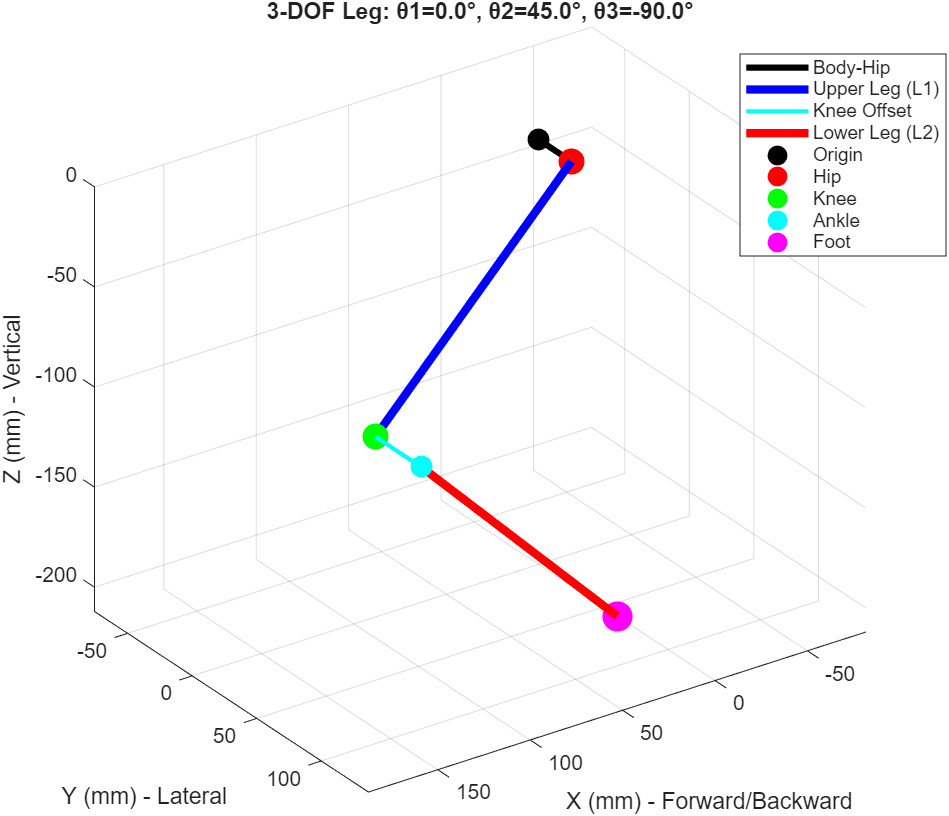

# 🤖 ANN-based Inverse Kinematics for Quadruped Robot Leg

<p align="center">
  
</p>

<p align="center">
  
  
  
  
  
</p>

---

## 📌 Overview

This project validates the use of an **Artificial Neural Network (ANN)** to solve the **Inverse Kinematics (IK)** problem for a 3-DOF quadruped robot leg built with MG995 servo motors. Instead of deriving complex analytical IK equations, a feedforward neural network is trained on data generated from the forward kinematics model and deployed on a Raspberry Pi for real-time control.

**The core idea:**
```
Desired foot position (x, y, z)  →  [Neural Network]  →  Joint angles (θ₁, θ₂, θ₃)
```

This is a **single-leg validation** of a larger quadruped robot IK control system.

---

## ✨ Key Features

- **Fast inference** — sub-millisecond IK solving on Raspberry Pi 4
- **Data-driven** — no closed-form IK derivation required
- **Full pipeline** — from MATLAB modeling → training → Python deployment → Arduino servo control
- **Corrected kinematics** — lateral knee offset (d₂) properly modeled and accounted for
- **Well-documented** — theoretical report, setup guide, and quick reference included

---

## 🦾 Hardware

| Component | Model | Role |
|-----------|-------|------|
| Single-board computer | Raspberry Pi 4 Model B | High-level controller, ANN inference |
| Microcontroller | Arduino Uno | Low-level servo control (PWM) |
| Servo motors (×3) | MG995 | Physical actuation of joints |
| Power supply | 5–6V, 2–3A external | Powers servos (NOT from Arduino) |
| Cable | USB-A to USB-B | Pi ↔ Arduino serial communication |

### Wiring

```
External Power (5-6V, 2-3A)
  ├── Servo 1 VCC  (Hip Ab/Ad)
  ├── Servo 2 VCC  (Hip Flex/Ext)
  ├── Servo 3 VCC  (Knee)
  └── GND ──────────────────── Arduino GND (common ground)

Arduino Uno
  ├── Pin 9  → Servo 1 Signal
  ├── Pin 10 → Servo 2 Signal
  ├── Pin 11 → Servo 3 Signal
  └── USB    → Raspberry Pi (serial)
```

> ⚠️ **Never power servos from Arduino's 5V pin.** MG995 servos draw up to 1A each under load.

---

## 📐 Leg Dimensions

```
Body Origin (0, 0, 0)
    │
    │ d₁ = 25.3 mm  (hip lateral offset)
    ▼
Hip Joint ──── [θ₁: Abduction/Adduction, ±45°]
    │
    │ L₁ = 150 mm  (upper leg / thigh)
    ▼
Knee ──── [θ₂: Hip Flex/Extension, ±90°]
    │
    │ d₂ = 35.5 mm  (knee bracket lateral offset, follows hip rotation)
    │ L₂ = 150 mm  (lower leg / shank)
    ▼
Foot (end-effector) ──── [θ₃: Knee Flexion, -135° to 0°]
```

**Coordinate system:** X = forward, Y = lateral, Z = up. Foot positions have negative Z (below body).

---

## 🏗️ System Architecture

```
┌─────────────────────────────────────────────────────────────┐
│              PC / Development Machine                       │
│                                                             │
│  leg_model_and_dataset.m  →  train_ann_model.m             │
│         (FK + Dataset)         (ANN Training)               │
│                                      │                      │
│                          convert_model_to_python.m          │
│                               (JSON Export)                 │
└───────────────────────────────────┬─────────────────────────┘
                                    │ model_for_python.json
                                    ▼
┌─────────────────────────────────────────────────────────────┐
│                    Raspberry Pi 4                           │
│                                                             │
│   raspberry_pi_controller.py                               │
│     ├── Load ANN model (JSON)                              │
│     ├── Inference: (x,y,z) → (θ₁,θ₂,θ₃)   [< 1 ms]      │
│     └── Serial TX: "θ₁,θ₂,θ₃\n"  @ 115200 baud           │
└───────────────────────────────────┬─────────────────────────┘
                                    │ USB Serial
                                    ▼
┌─────────────────────────────────────────────────────────────┐
│                      Arduino Uno                            │
│                                                             │
│   arduino_servo_controller.ino                             │
│     ├── Parse received angles                              │
│     ├── Validate against joint limits                      │
│     ├── Map to servo PWM range [0°, 180°]                  │
│     └── Drive Servo 1, 2, 3                                │
└──────────────┬──────────────┬──────────────┬───────────────┘
               │              │              │
           Servo 1         Servo 2        Servo 3
         (Hip Ab/Ad)   (Hip Flex/Ext)    (Knee)
```

---

## 🧠 Neural Network

**Architecture:** `3 → 64 → 64 → 3`

| Layer | Neurons | Activation | Role |
|-------|---------|------------|------|
| Input | 3 | — | x, y, z position (mm) |
| Hidden 1 | 64 | tanh | Feature extraction |
| Hidden 2 | 64 | tanh | Feature combination |
| Output | 3 | Linear | θ₁, θ₂, θ₃ (degrees) |

**Total parameters:** 4,611  
**Training algorithm:** Levenberg-Marquardt  
**Dataset size:** 50,000 samples (generated via Forward Kinematics)  
**Expected accuracy:** MAE < 2°, R² > 0.99

---

## 🗂️ Repository Structure

```
📦 ann-ik-quadruped-leg/
├── 📁 matlab/
│   ├── leg_model_and_dataset.m      # Step 1: FK model + dataset generation
│   ├── train_ann_model.m            # Step 2: ANN training
│   └── convert_model_to_python.m   # Step 3: Export model to JSON
│
├── 📁 python/
│   └── raspberry_pi_controller.py  # Main controller: ANN inference + serial TX
│
├── 📁 arduino/
│   └── arduino_servo_controller.ino # Servo control via serial RX
│
├── 📁 docs/
│   ├── THEORETICAL_REPORT.md       # Full theory: mechanics → ANN
│   ├── SETUP_GUIDE.md              # Step-by-step hardware + software setup
│   └── QUICK_REFERENCE.md          # Commands, positions, troubleshooting
│
└── README.md
```

---

## 🚀 Getting Started

### Prerequisites

**PC (MATLAB):**
- MATLAB R2020a or later
- Deep Learning Toolbox

**Raspberry Pi:**
- Ubuntu 22.04.5 LTS (64-bit)
- Python 3.8+
- `pip3 install numpy pyserial`

**Arduino:**
- Arduino IDE
- `Servo.h` (built-in)

---

### Step 1 — Generate Dataset & Train Model (MATLAB on PC)

```matlab
% Run in order:
run('matlab/leg_model_and_dataset.m')   % Generates leg_ik_dataset.mat + visualizations
run('matlab/train_ann_model.m')         % Trains ANN, saves trained_ik_model.mat
run('matlab/convert_model_to_python.m') % Exports model_for_python.json
```

Expected output after training:

```
MAE:  ~1.0–1.5°
RMSE: ~1.2–2.0°
R²:   ~0.995–0.999
```

---

### Step 2 — Upload Arduino Code

1. Open `arduino/arduino_servo_controller.ino` in Arduino IDE
2. Select **Board → Arduino Uno** and the correct **Port**
3. Click **Upload**
4. Verify in Serial Monitor (115200 baud): `Arduino 3-DOF Leg Controller Ready`

---

### Step 3 — Deploy to Raspberry Pi

```bash
# On your PC — transfer files to Pi
scp model_for_python.json pi@<your-pi-ip>:~/
scp python/raspberry_pi_controller.py pi@<your-pi-ip>:~/

# SSH into Pi
ssh pi@<your-pi-ip>

# Add user to serial group (once)
sudo usermod -a -G dialout $USER
# Log out and back in

# Run the controller
python3 raspberry_pi_controller.py
```

If Arduino is on a different port:

```bash
python3 raspberry_pi_controller.py /dev/ttyUSB0
```

---

### Step 4 — Control the Leg

When the controller starts, choose a mode:

```
Select mode:
  1. Test sequence  (automated demo positions)
  2. Interactive    (type positions manually)
```

**Interactive mode — enter positions as `x y z` (mm):**

```
Enter position (x y z): 150 0 -150
Target position: (150.0, 0.0, -150.0) mm
Predicted angles: θ1=0.00°, θ2=38.94°, θ3=-77.88°
Arduino response: OK: 0.00,38.94,-77.88
```

**Safe starting positions to try:**

```
150 0 -150     # Center, medium height (recommended first)
100 50 -100    # Forward-right, high
100 -50 -100   # Forward-left, high
200 0 -200     # Far forward, low
```

---

## 📊 Performance

| Metric | Expected | Notes |
|--------|----------|-------|
| ANN inference | < 1 ms | On Raspberry Pi 4 |
| Serial latency | ~10 ms | 115200 baud |
| Servo response | 20–60 ms | MG995 at 6V |
| **Total latency** | **~50 ms** | End-to-end |
| Joint angle MAE | < 2° | On test set |
| Position error | < 10 mm | Typical foot error |

---

## 🔧 Calibration

If servos move in the wrong direction, edit these constants in `arduino_servo_controller.ino`:

```cpp
const float SERVO1_OFFSET    = 90.0;   // Center position (0° joint = 90° servo)
const float SERVO1_DIRECTION = 1.0;    // Change to -1.0 to reverse direction

const float SERVO2_OFFSET    = 90.0;
const float SERVO2_DIRECTION = 1.0;

const float SERVO3_OFFSET    = 90.0;
const float SERVO3_DIRECTION = -1.0;   // Knee often reversed
```

Re-upload after changes.

---

## 🐛 Troubleshooting

| Problem | Solution |
|---------|----------|
| `Permission denied` on serial port | `sudo chmod 666 /dev/ttyACM0` or add user to `dialout` group |
| Servos don't move | Check external power supply (5–6V, 2A+) and common ground |
| Wrong servo direction | Flip `DIRECTION` sign in Arduino code |
| `model_for_python.json` not found | Re-run `convert_model_to_python.m` and re-copy to Pi |
| Arduino not detected | Try `/dev/ttyUSB0` instead of `/dev/ttyACM0` |
| Jerky movement | Insufficient power supply current; add capacitors across servo rails |
| High IK error | Retrain with more samples or adjust network size |

---

## 📖 Documentation

- [`docs/THEORETICAL_REPORT.md`](docs/THEORETICAL_REPORT.md) — Complete theory: rigid body kinematics, FK derivation, IK problem, ANN fundamentals, backpropagation, Levenberg-Marquardt, deployment
- [`docs/SETUP_GUIDE.md`](docs/SETUP_GUIDE.md) — Full step-by-step hardware and software setup
- [`docs/QUICK_REFERENCE.md`](docs/QUICK_REFERENCE.md) — Commands, safe positions, calibration notes

---

## 🔭 Future Work

- [ ] Extend to full 4-leg quadruped
- [ ] Implement gait patterns (trot, walk, bound)
- [ ] Add closed-loop feedback (encoders / IMU)
- [ ] Train with dynamics (velocity, torque awareness)
- [ ] Port to TensorFlow Lite for faster Pi inference
- [ ] Web dashboard for real-time position input

---

## 🛠️ Built With

- **MATLAB** — Forward kinematics, dataset generation, ANN training
- **Python / NumPy** — ANN inference on Raspberry Pi
- **Arduino (C++)** — PWM servo control
- **MG995** — Servo motors
- **Raspberry Pi 4** — Embedded Linux controller

---

## 📄 License

This project is licensed under the MIT License — see the [LICENSE](LICENSE) file for details.

---

## 🙏 Acknowledgements

- Inspired by research in data-driven robot control and learning-based inverse kinematics
- MG995 servo specs from manufacturer datasheet
- Levenberg-Marquardt implementation via MATLAB Deep Learning Toolbox

---

<p align="center">Made with ❤️ for robotics</p>
